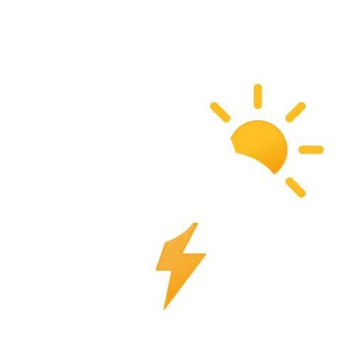
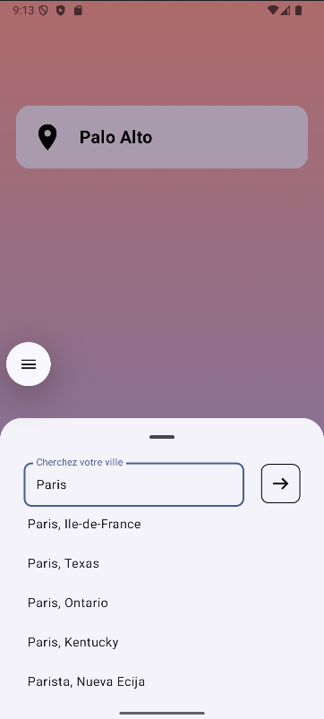
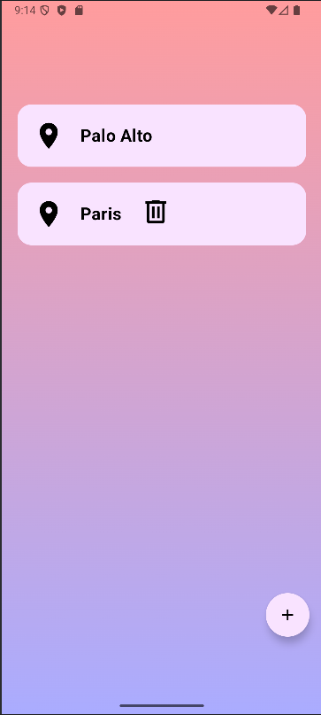
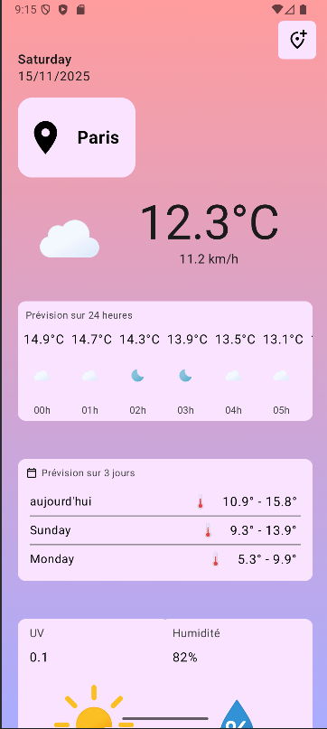

# In ENGLISH 🇬🇧

    

## WeatherUsmb

WeatherUsmb is a native Android weather application built with Kotlin and Jetpack Compose. It fetches real-time weather data from WeatherAPI to provide users with current conditions, hourly forecasts, and a 3-day forecast for various locations. The app supports automatic location detection, city search, and a persistent list of saved cities.

## Features

-   **Current Weather:** Displays detailed current weather, including temperature, condition (e.g., "Sunny," "Cloudy"), wind speed, humidity, and UV index.
-   **Hourly & Daily Forecasts:** Provides a 24-hour hourly forecast and a 3-day forecast with minimum and maximum temperatures.
-   **GPS Location:** Automatically detects the user's current location on startup to provide immediate local weather.
-   **City Management:**
    -   Search for cities worldwide.
    -   Add cities to a personal list.
    -   View and delete saved cities.
-   **Dynamic UI:** The user interface features custom icons that change based on the weather conditions.
-   **Local Storage:** Saved cities and their latest weather data are stored locally in a JSON file for offline access and quick loading.
-   **Automatic Refresh:** Weather data for all saved cities is periodically refreshed in the background to stay up-to-date.

## Application Screens
-   **City List Screen (`CityActivity`):** The primary screen that displays a list of the user's saved cities. From here, you can navigate to the detailed weather view for any city, add new cities via a search modal, or delete existing ones.
-   **Weather Details Screen (`MainActivity`):** Shows a comprehensive weather report for a selected city, including an overview, 24-hour breakdown, 3-day forecast, and additional metrics like humidity and UV index.

    

    

    

# En FRANCAIS  🇫🇷

    

## WeatherUsmb

WeatherUsmb est une application météo Android native construite avec Kotlin et Jetpack Compose. Il récupère des données météorologiques en temps réel de WeatherAPI pour fournir aux utilisateurs les conditions actuelles, les prévisions horaires et une prévision sur 3 jours pour divers endroits. L’application prend en charge la détection automatique de localisation, la recherche de villes et une liste persistante des villes enregistrées.

## Caractéristiques

-   **Météo actuelle :** Affiche le temps actuel détaillé, y compris la température, l’état (par exemple, « Ensoleillé », « Nuageux »), la vitesse du vent, l’humidité et l’indice UV.
-   **Prévisions horaires et quotidiennes :** Fournit une prévision horaire sur 24 heures et une prévision sur 3 jours avec des températures minimales et maximales.
-   **GPS Location:** Détecte automatiquement la position actuelle de l’utilisateur au démarrage pour fournir une météo locale immédiate.
-   **Gestion de la ville :**
    -   Recherchez des villes dans le monde entier.
    -   Ajouter des villes à une liste personnelle.
    -   Afficher et supprimer les villes enregistrées.
-   **UI dynamique :** L’interface utilisateur propose des icônes personnalisées qui changent en fonction des conditions météorologiques.
-   **Stockage local :** Les villes enregistrées et leurs dernières données météorologiques sont stockées localement dans un fichier JSON pour un accès hors ligne et un chargement rapide.
-   **Rafraîchissement automatique :** Les données météorologiques pour toutes les villes enregistrées sont périodiquement rafraîchies en arrière-plan pour rester à jour.

## Écrans d’application
-   **Écran de liste de villes (`CityActivity`):** L’écran principal qui affiche une liste des villes sauvegardées par l’utilisateur. De là, vous pouvez naviguer vers la vue météo détaillée pour n’importe quelle ville, ajouter de nouvelles villes via une recherche modale ou supprimer des villes existantes.
-   **Écran de détails météorologiques (`MainActivity`) :** Affiche un rapport météorologique complet pour une ville sélectionnée, y compris un aperçu, une ventilation 24 heures sur 24, des prévisions à 3 jours et des métriques supplémentaires comme l’humidité et l’indice UV.

    

    

    

